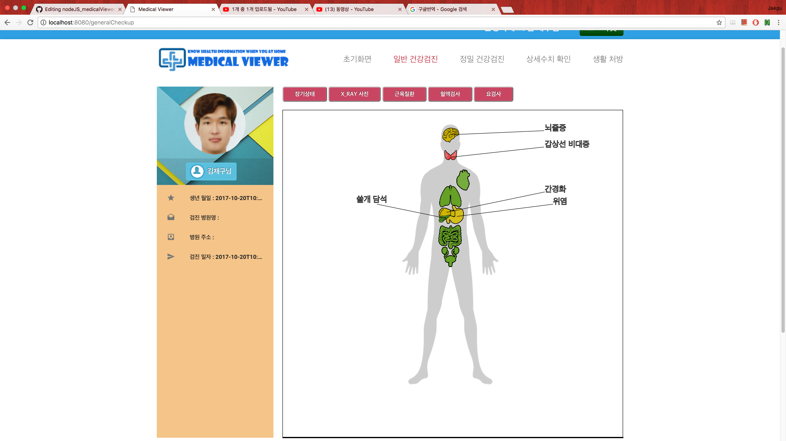
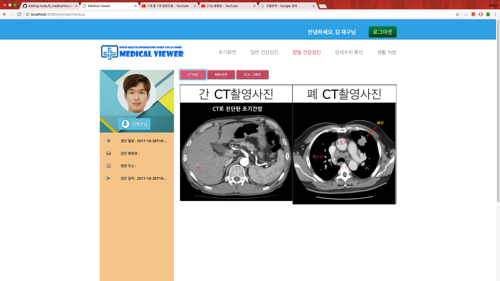
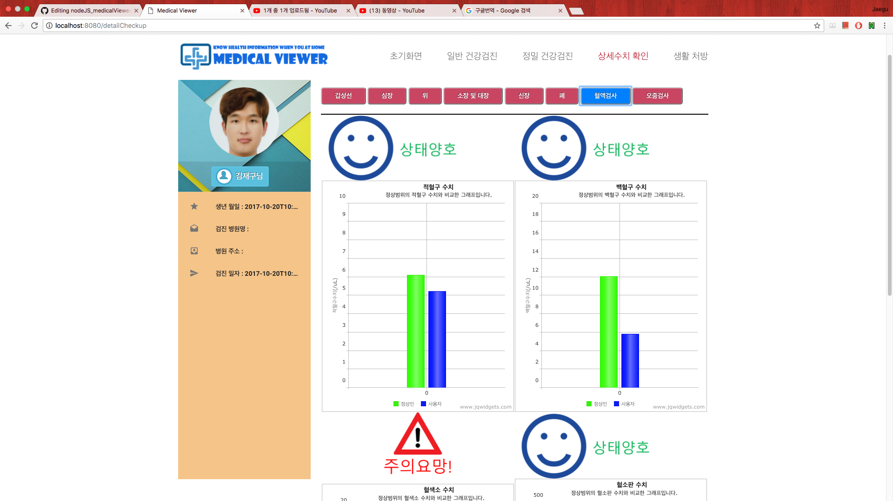
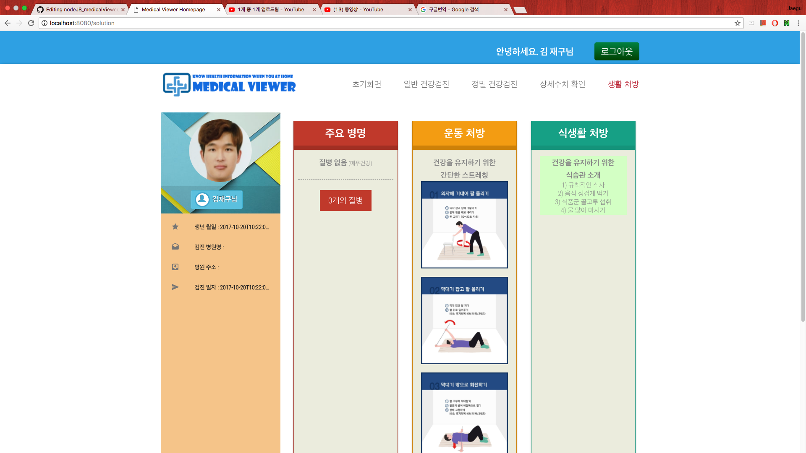

# MedicalViewer   
* Summary   
This is web-based medical checkup viewer service implemented by nodeJS, Express, Mongoose .   
# Main Function   
1. login/join   
2. providing general checkup result by showing anatomy picture filled with organ pictures.   
3. prividing precise checkup result by showing CT,MRI and ECG graph.   
4. providing solutions about user's health    
# Demonstration Video   
https://youtu.be/U7887dVOz5s   
# Screenshot   

